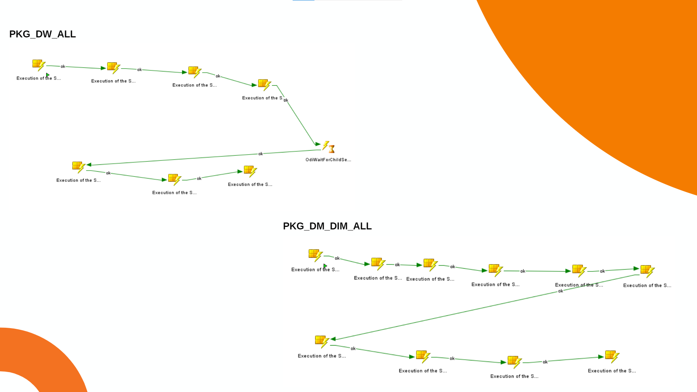

## Oracle and Power BI Group Project - Part of IntelliCamp (data camp for 3 weeks within a business intelligence company Intellica in Turkey)

The whole project consists of data modeling/engineering in Oracle ODI-Toad, and Power BI. 

We started from the given source tables. Then, we first maintained the DW level tables. Finally, we reached the DM level and FACT level mostly through Oracle ODI. 

We also wrote the Oracle SQL queries for validation, including complex queries with up to 7 joins and multiple filters.

In the end, we automated a weekly process within banking industry through packages and a loop in ODI.

See the live [dashboard](https://app.powerbi.com/view?r=eyJrIjoiMDU2MjlmOGMtZjc1Ni00NjE0LTg2NDAtMmNhYzAyMTgzNDlhIiwidCI6ImYxZDg2ZWI5LWFhZjEtNGZiNC05ODVlLTkxOWNkMGE1ODQzMSIsImMiOjl9&pageName=89534e3947269b4a6e9a) 

Our presentation images are below:

### Thank you!
